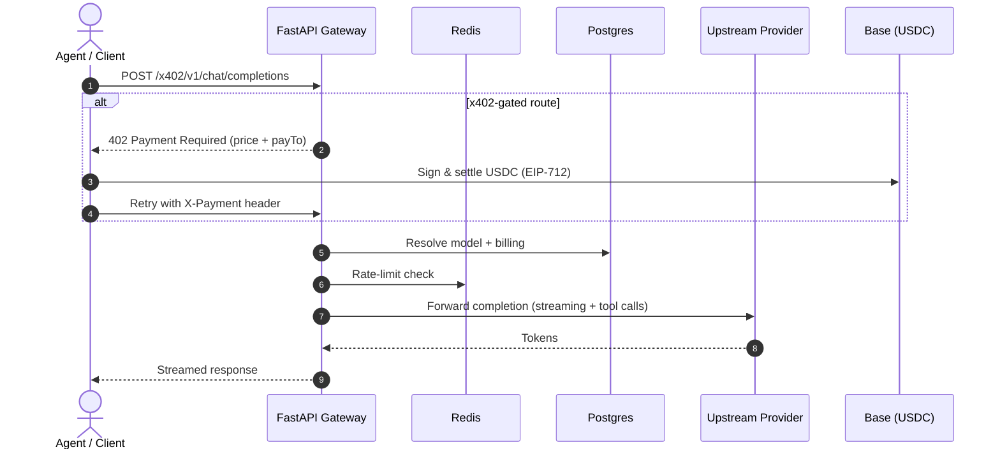

# CortexCloud API Gateway

> Agent-native, OpenAI-compatible AI gateway with **x402 crypto payments** (USDC on Base). Pay per call — no API key, no subscription.

CortexCloud is a production-grade AI inference + data gateway. It unifies multiple AI
providers (OpenAI, Anthropic, Gemini, Groq, NVIDIA) behind a single OpenAI-compatible API
surface, and exposes a growing set of **x402 payment-gated endpoints** so agents can pay
per-call in USDC on Base mainnet — no account, no credit card, no API key required.

---

## Features

- **OpenAI-compatible gateway** — `/v1/chat/completions`, `/v1/models`, embeddings, and more.
- **Multi-provider routing** — OpenAI, Anthropic, Gemini, Groq, NVIDIA with automatic
  fallback chains and cost/latency-aware model resolution.
- **x402 payment rails** — payment-gated AI + data endpoints. Agents pay in USDC on Base
  via the `402 Payment Required` → sign → settle handshake (CDP v2 / EIP-712).
- **On-chain & market data marketplace** — keyless Base data routes (token prices, DEX
  pools, wallet balances) and structured on-chain tools, all payable per call.
- **Activity & pricing feeds** — public `/x402/v1/activity` (live settlement feed) and
  `/x402/v1/pricing` (per-model + per-tool USDC pricing) for discovery and dashboards.
- **Bazaar / x402scan discovery** — self-describing OpenAPI + resource registry so agents
  and explorers (x402scan, AgentCash) can enumerate payable endpoints and verify ownership.
- **Enterprise controls** — API-key auth (HMAC-SHA256), RBAC orgs, Redis-backed sliding
  window rate limiting, precision billing ledger, audit logging, correlation-ID tracing.
- **Observability** — structured logging, health checks, retries with fallback, and a
  Dockerized, Alembic-migrated deployment.

---

## Architecture



---

## Repository Layout

```
app/
  main.py                 # FastAPI app, router mounting, static landing page
  core/                   # config, logging, redis, security
  auth/                   # API-key (HMAC) + dependency injection
  billing/                # Plugin-based billing ledger (base + mock)
  providers/              # openai, anthropic, gemini, groq, nvidia (translation)
  routing/router.py       # model resolution + fallback chains
  middleware/             # rate_limit, trace, x402 payment, x402_rate_limit
  models/                 # registry, usage, key, org, user, billing (SQLAlchemy)
  services/               # model + usage services
  api/v1/                 # /v1 chat completions + models
  x402/                   # payment routes, data marketplace, on-chain tools,
                          #   bazaar discovery, status, pricing
  activity.py             # live settlement activity feed
  pricing.py              # per-model / per-tool USDC pricing table
static/                   # branded landing page (index.html, favicon)
tests/                    # pytest integration suite
docs/x402-testing-guide.md
```

---

## Quickstart

### 1. Install
```bash
python -m venv .venv && source .venv/bin/activate
pip install -r requirements.txt
```

### 2. Configure
```bash
cp .env.example .env   # fill in provider keys + WALLET_ADDRESS
```

### 3. Databases
```bash
docker-compose up -d
alembic upgrade head
python -m app.scratch.seed_dev
```

### 4. Run
```bash
uvicorn app.main:app --host 0.0.0.0 --port 8000
# Docs: http://localhost:8000/docs
```

---

## API Examples

### Standard (API key)
```bash
curl -X POST http://localhost:8000/v1/chat/completions \
  -H "Authorization: Bearer cx-liv...7890" \
  -H "Content-Type: application/json" \
  -d '{"model":"gpt-4o","messages":[{"role":"user","content":"Explain quantum computing."}]}'
```

### x402 (pay per call, no key)
Agents send the request, receive a `402` with the price, settle USDC on Base, and retry
with the `X-Payment` header. The easiest path is a client that does this automatically:

```bash
# Local OpenAI-compatible proxy that auto-pays x402 (our ClawRouter equivalent)
npx -y @cortexcloud.org/proxy
# then point any OpenAI SDK at http://localhost:8402/v1
```

Public, keyless discovery endpoints:
- `GET  /x402/v1/models`     — payable model list
- `GET  /x402/v1/pricing`    — USDC pricing per model/tool
- `GET  /x402/v1/activity`   — live settlement feed
- `POST /x402/v1/chat/completions` — pay-per-call inference
- `POST /x402/v1/data/*`     — payable Base market/data tools

---

## SDKs & Clients

| Package | Purpose |
|---------|---------|
| `@cortexcloud.org/mcp`   | MCP server (Claude Code / MCP agents) — paid x402 tools |
| `@cortexcloud.org/proxy` | Local OpenAI-compatible proxy that auto-pays x402 per call |

---

## Testing
```bash
pytest tests/test_gateway.py -p no:warnings
```

See `docs/x402-testing-guide.md` for the x402 payment-flow test plan.

---

## Deployment
```bash
docker build -t cortexcloud-api:latest .
docker-compose up -d
```
The branded landing page is served at `/` and the x402 discovery surface at `/x402/v1/*`.

---

## Security

- Secrets live only in `.env` (gitignored). Never commit keys.
- x402 payments use EIP-712 typed-data signatures settled on Base mainnet.
- API keys are HMAC-SHA256 authenticated; rate limits are Redis-backed with DB fallback.

See [SECURITY.md](SECURITY.md).

---

## Roadmap

- [ ] Redis model-registry caching (TTL) to cut DB reads
- [ ] Multi-chain settlement (Solana CAIP-22, Polygon/Arbitrum/Optimism via Circle Gateway)
- [ ] Response caching + `/metrics` (Prometheus)
- [ ] Image generation + speech (TTS/STT) endpoints
- [ ] Python + TypeScript SDKs with built-in x402 clients
- [ ] Expanded test coverage (providers, routing, billing)

---

## License

MIT — see [LICENSE](LICENSE).
